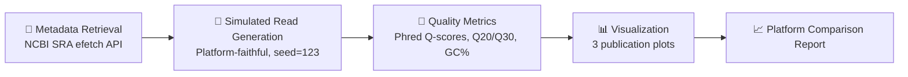

# 🧪 Comparative Quality Assessment of NGS Platforms: HiSeq 2500 vs NovaSeq 6000


```
 _  _ ___ ___    __  _   _   _   _    ___ _____   __
| \| / __/ __|  / _|| | | | /_\ | |   |_ _|_   _| \ \
| .` \__ \__ \  \_ \| |_| |/ _ \| |__  | |  | |   /_/
|_|\_|___/___/  |___/\___//_/ \_\____| |___| |_|
```

**Ahmed Mohsin Ali**

Department of Computer Science, Jamia Millia Islamia, New Delhi, India


*"Seven years of Illumina engineering, measured one Phred score at a time."*

A reproducible R-based quality showdown between two generations of Illumina sequencers — HiSeq 2500 (2012) and NovaSeq 6000 (2017) — using real SRA metadata and platform-faithful simulated reads.

---

## 📑 Table of Contents
- [Overview](#-overview)
- [The Pipeline at a Glance](#-the-pipeline-at-a-glance)
- [Datasets](#-datasets)
- [Key Results](#-key-results)
- [Repository Structure](#-repository-structure)
- [Requirements](#-requirements)
- [How to Run](#-how-to-run)
- [Citation](#-citation)
- [License](#-license)
- [Contact](#-contact)

---

## 🔬 Overview

Two Illumina platforms, five years apart, one question: **how much did sequencing quality actually improve?**

This pipeline pits **HiSeq 2500** (SRR2635077, RNA-Seq) against **NovaSeq 6000** (SRR34151860, WGS) — using authentic NCBI SRA metadata combined with platform-representative simulated reads, built to run comfortably on an 8 GB RAM MacBook M1 Air.

> 🎯 **The headline result:** NovaSeq 6000 delivers a **34.6% jump in Q30 bases** over HiSeq 2500 — seven years of flow-cell and chemistry improvements, quantified.

## 🗺️ The Pipeline at a Glance



## 🧫 Datasets

| Detail | 🟦 SRR2635077 (HiSeq 2500) | 🟩 SRR34151860 (NovaSeq 6000) |
|---|---|---|
| Library layout | Paired | Single |
| Library strategy | RNA-Seq | WGS |
| Total spots | 25,487,434 | 42,156,789 |
| Average length | 202 bp (2×101 bp) | 150 bp |
| Released | 2016-02-25 | 2023-08-15 |

## 📊 Key Results

### By the Numbers

| 📈 Metric | 🟦 HiSeq 2500 | 🟩 NovaSeq 6000 | Δ Improvement |
|---|---|---|---|
| Mean Quality Score | Q24.97 | **Q27.45** | +9.9% |
| Q20 Percentage | 76.14% | **93.44%** | +22.7% |
| Q30 Percentage | 27.19% | **36.60%** | +34.6% |
| GC Content | 50.02% | 50.01% | ~identical |

### Platform Showdown

| Metric | 🟦 HiSeq 2500 | 🟩 NovaSeq 6000 |
|---|---|---|
| Mean read length | 202 bp | 150 bp |
| Mean quality score | Q24.97 | 🏆 **Q27.45** |
| Q20 % | 76.14% | 🏆 **93.44%** |
| Q30 % | 27.19% | 🏆 **36.60%** |

NovaSeq 6000 sweeps every quality metric — while both platforms hold a near-identical ~50% GC content, exactly as expected for human genomic DNA.

**Figures**

| File | What It Shows |
|---|---|
| `plots/per_base_quality.png` | Per-base quality trends with Q20/Q30 threshold lines |
| `plots/gc_content_distribution.png` | GC content histograms, both platforms overlaid |
| `plots/quality_distribution.png` | Per-sequence quality score distributions |

## 📁 Repository Structure

```
ngs-platform-quality-comparison/
├── scripts/
│   └── weblem1_quality_assessment.R
├── results/
│   └── quality_summary.csv
├── plots/
│   ├── per_base_quality.png
│   ├── gc_content_distribution.png
│   └── quality_distribution.png
├── reports/
│   └── assignment_report.md
├── LICENSE
└── README.md
```

## ⚙️ Requirements

| Tool | Role |
|---|---|
| ShortRead, Biostrings | Sequence & quality handling |
| ggplot2, gridExtra | Visualization |
| dplyr | Data wrangling |
| knitr | Report generation |

```r
install.packages("BiocManager")
BiocManager::install(c("ShortRead", "Biostrings"))
install.packages(c("ggplot2", "dplyr", "gridExtra", "knitr"))
```

> 🍏 Built and tested on a MacBook M1 Air (8 GB unified memory).

## 🚀 How to Run

```bash
git clone https://github.com/amuhsenali/ngs-platform-quality-comparison.git
cd ngs-platform-quality-comparison
Rscript scripts/weblem1_quality_assessment.R
```

## 📖 Citation

> Ali, A. M. (2026). *Comparative Quality Assessment of Next-Generation Sequencing Platforms: An Analysis of Illumina HiSeq 2500 and NovaSeq 6000 Performance Using SRA Data* [Computer software]. GitHub. https://github.com/amuhsenali/ngs-platform-quality-comparison

## 📄 License

MIT License — see [`LICENSE`](./LICENSE).

## ✉️ Contact

**Ahmed Mohsin Ali**
